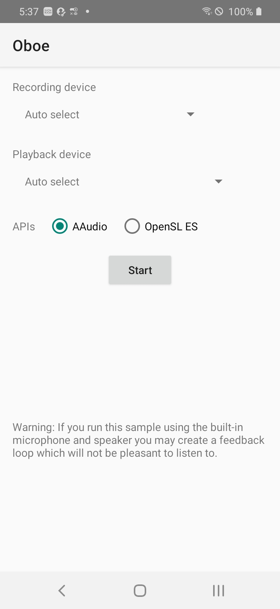

# oboe_mock

oboeのサンプルにはassetsに配置されたファイルの再生や、マイクの音声のみをoutputしてるものが多く存在しています   
このrepositoryではローカル上のファイル（PCM/16ビット）の再生、およびマイク音声の合成を行っています  

oboe samples：https://github.com/google/oboe/tree/master/samples  
お借りしたPCM音源：https://www.sony.jp/ic-recorder/sound-compare/pcm/  

 

# Documents

## Installation
今回は趣旨が異なるので詳しくは下記を参照してください  
このrepositoryでは [prefabを使用する方法](https://github.com/google/oboe/blob/master/docs/GettingStarted.md#option-1-using-pre-built-binaries-and-headers) で実装しています
- [GettingStarted](https://github.com/google/oboe/blob/master/docs/GettingStarted.md)
- [FullGuide](https://github.com/google/oboe/blob/master/docs/FullGuide.md)

## APIs
oboeのAPI周りの不明点があれば下記を参照してください
- [API reference](https://google.github.io/oboe/reference/namespaceoboe.html)

 

# Screenshot
このrepositoryではC++レイヤーに手を加えることが目的となるため、表示周りは [LiveEffect](https://github.com/google/oboe/tree/master/samples/LiveEffect) のサンプルを流用させていただいています  

 

# Summary

`/oboe_mock/main/app/src/main/cpp/` 配下に追加しているファイルに関して、ざっくりとした概要は下記になります

### AudioEngine
- oboeの設定/outputの加工/inputの加工を行うファイル群の管理クラス
- jni_bridgeからのみ呼ばれる

### DuplexEngine
- oboe周りの設定を集約させたクラス
- 今回はPCMファイルを読み込んでoutputとして書き出すのに`oboe::AudioFormat::I16`(int16_t)が楽だったのでこちらを使用
- input/outputをそれぞれcallback(DuplexCallback)として返す
- input/outputの合成もここで行っている

### decoder/WavDecoder
- PCM/16ファイルの読み込み、およびoutputに対して書き込むクラス
- 読み込んだファイルの再生時の音量設定もここで行っている
- 16bit固定で扱っているが、ここを動的に扱いたい場合は [WavStreamReader](https://github.com/google/oboeblob/82fff1041c/samples/parselib/src/main/cpp/wav/WavStreamReader.h) に一部、または全てを食わせて [WavStreamReader#getSampleEncoding()](https://github.com/google/oboe/blob82fff1041c8ba5e82ffb67f373d7d17b59a29411/samples/parselib/src/main/cpp/wav/WavStreamReader.cpp#L45) で取得すればできるかも？
  - 使い方は [DrumPlayerJNI](https://github.com/google/oboe/blob/82fff1041c8ba5e82ffb67f373d7d17b59a29411/samples/drumthumper/src/main/cpp/DrumPlayerJNI.cpp#L84) あたりを参照

### renderer/MicRenderer
- inputに対して音量設定しているクラス
- なにかエフェクトを追加したい場合もここで行う想定

 

# Finally
ほぼ自分の備忘録的に書いてますが、何かの役に立てればと思います  
それではよいoboeライフを♪
